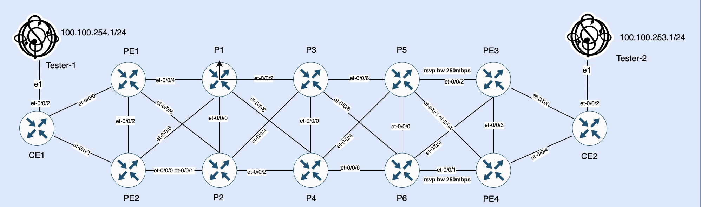
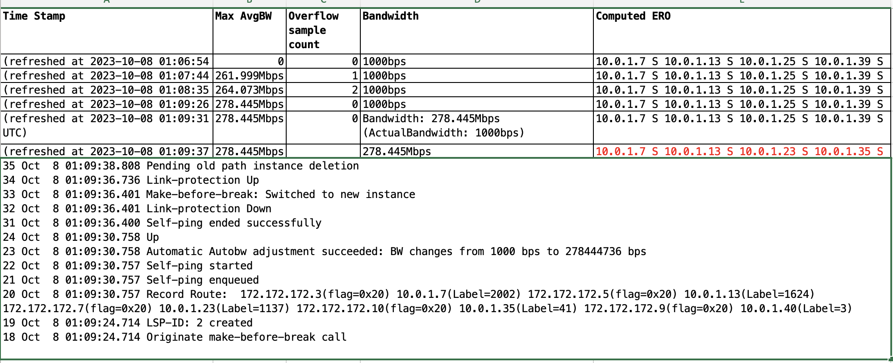

# MPLS-Auto-BW-Junos

## Executive Summary
RSVP traffic engineering (TE) capabilities are so enriched that it would require a lengthy book to cover all the TE capabilities.  One of very attractive feature of rsvp singled Label Switch Path (LSP) is to signal or reserve bandwidth across the physical links through which LSP traverses and to avoid links over subscription during LSP setup rsvp also offers a feature to subscribe links bandwidth out of total bandwidth. Static bandwidth for LSPs does not suit production network as production network traffic patrons are not always static. So, LSP signaled with static bandwidth configuration as it does not cater dynamic bandwidth adjustments which is often required due to increase or decrease in traffic volume. Auto-bandwidth provides capability to adjust LSP bandwidth signaling based on traffic needs.  In this document I will endeavor to cover RSVP auto-bandwidth capabilities and how it can help to optimally utilise rsvp enabled links in MPLS backbone network. 

All of LSP bandwidth signaling , rsvp link subscription is control plane based activities and does not put any restriction on forwarding plane traffic. 

## Lab Topology 

## Testbed Details
Junos EVO 23.2R1.15-EVO, Platform Virtual ptx10001-36mr ,Ostinato Traffic Generator 
## RSVP Subscription
RSVP provides a feature to subscribe link bandwidth in percentage out of total physical link bandwidth. This feature helps to avoid over-subscription of any link during LSP signaling , if total bandwidth demand through any rsvp link surpass the subscribed value then no more LSP will be singled over that link. 

```
rsvp {
        interface et-0/0/2.0 {
            subscription 90;
 
        }
    }
show rsvp interface 
                          Active  Subscr- Static      Available   Reserved    Highwater
Interface          State  resv    iption  BW          BW          BW          mark
et-0/0/2.0             Up       2    90%  10Gbps      9Gbps       1000bps     1000bps 
```
In above configuration , et-0/0/2 is configured to subscribe 90 % of link total bandwidth (Static Bw), and currently Reserved Bw is 1000bps, Available Bw describes how much bandwidth is available once Subscription is done from Static Bw. High water mark shows maximum bandwidth reservation happened on this link. 

In my topology I have also configured rsvp bandwidth on certain link to reduce Static Bw (physical interface bandwidth available to rsvp) to 250mbps, please have a look on above topology diagram for reference. 
```
 protocols {
 rsvp {
   interface et-0/0/2.0 {
            subscription 90;
            bandwidth 250m;
        }
}
}


                          Active  Subscr- Static      Available   Reserved    Highwater
Interface          State  resv    iption  BW          BW          BW          mark
et-0/0/2.0             Up       2    90%  250Mbps     224.999Mbps 1000bps     561.07Mbps 
```
Above arrangement is done to simulate a scenario if an interface physical bandwidth is 100% utilized due to actual traffic then CSPF should find new path for LSP auto-bandwidth adjustment in make-before-break fashion over new path. 

## Auto-Bandwidth
As, name suggests auto bandwidth feature provides functionality to adjust MPLS LSP bandwidth dynamically based on traffic statistics sampling. One auto bandwidth is enabled over an LSP then it's traffic samples are captured to get max bandwidth utilization during each sampling period. LSP bandwidth is automatically adjusted after an adjust interval if maximum bandwidth utilization (MaxAvg Bandwidth) during  then sampling period is more than specified threshold of presently signaled bandwidth. If any of link in current LSP path does not have enough bandwidth to adjust new bandwidth requirement then LSP is signaled to a new path, once traffic will be shifted new path then old path will be terminated.  Adjustment of bandwidth on current path or on new path happens happens in make before break fashion. If no new path is available to accommodate new bandwidth requirement then current path will be held as it is.

Following snippet provided minimum configuration to enable auto-bandwidth feature in Junos.  Statistics interval values is in seconds and it specifies sampling period to collect maximum utilized bandwidth during this sampling period. Adjust interval for a LSP is specified using adjust-interval (value in seconds) and adjust-thershold value is taken as percentage. It's best practice to keep adjust-interval=>3 x stats-interval. 

```
protocols {
    mpls {
        statistics {
            file auto-bw;
            interval 50;
            auto-bandwidth;
        }
        label-switched-path to-remote-pe {
            from 172.172.172.1;
            to 172.172.172.2;
            adaptive;
            auto-bandwidth {
                adjust-interval 7200;
                adjust-threshold 3;     
                minimum-bandwidth 1k;
                maximum-bandwidth 10g;
            }
        }
    }
}
```

With above configuration a LSP will be signaled with minimum-bandwidth of 1g and it's traffic samples will be captured with frequency of 50 seconds to get maximum bandwidth utilization (Maxing Bandwidth). LSP aut-bandwidth adjustment will happen only if after passage of an adjust-interval, any of recorded Maxing Bandwidth is 3 percent more than presently singled bandwidth. If old and new path are signaled over some come link then adaptive knob will help to avoid double counting of bandwidth by old and new LSP. 

Relying only on stats-interval and adjust-interval is good to handle dynamic bandwidth requirements which happened over longer duration but modern application could send traffic bursts during smaller duration and above arrangement will not help to handle short duration traffic bursts. 
 
RSVP traffic engineering (TE) capabilities covers us for such situation with more sophisticated knobs (i.e adjust-threshold-overflow-limit and adjust-threshold-underflow-limit). These knobs work in conjunction with stats-interval e.g as per below configuration 3 consecutive samples are captured and if bandwidth changes are more then 3 percent (adjust-threshold) of  the current bandwidth then LSP bandwidth will be adjusted as per highest or lowest change recorded during 50x3 seconds interval. Minmum allowed value for stats-interval*adjust-threshold-overflow-limit or stats-interval*adjust-threshold-underflow-limit is 150 and I am using adjust-threshold-overflow-limit/adjust-threshold-underflow-limit value 3 and stats-interval value 50. I have read doucments with  adjust-threshold-underflow-limit value 5 and stats-interval value 30. 


```
protocols {
    mpls {
        statistics {
            file auto-bw;
            interval 50;
            auto-bandwidth;
        }
        label-switched-path to-remote-pe {
            from 172.172.172.1;
            to 172.172.172.2;
            adaptive;
            auto-bandwidth {
                adjust-interval 7200;
                adjust-threshold 3;     
                minimum-bandwidth 1k;
                maximum-bandwidth 10g;
                adjust-threshold-overflow-limit 3;
                adjust-threshold-underflow-limit 3;
            }
        }
    }
}
```

Introducing adjust-threshold-overflow-limit and adjust-threshold-underflow-limit could cause aggressive re-signaling of LSPs in response to micro bursts and if we want to introduce more stable reaction to bandwidth changes then another knob adjust-threshold-activate-bandwidth (value in bps) can be introduced and it will allow LSP re-signaling only if change in bandwidth surpasses the adjust-threshold-activate-bandwidth value in addition to adjust-threshold. In below given configuration I am using adjust-threshold-activate-bandwidth value to 25 m which means bandwidth changes should surpasses this value for past 3 (50 seconds samples) to readjust the bandwidth. 
```
protocols {
    mpls {
        statistics {
            file auto-bw;
            interval 50;
            auto-bandwidth;
        }
        label-switched-path to-remote-pe {
            from 172.172.172.1;
            to 172.172.172.2;
            adaptive;
            auto-bandwidth {
                adjust-interval 7200;
                adjust-threshold 3;     
                minimum-bandwidth 1k;
                maximum-bandwidth 10g;
                adjust-threshold-overflow-limit 3;
                adjust-threshold-underflow-limit 3;
                adjust-threshold-activate-bandwidth 25m;
            }
        }
    }
}
```
* Disclaimer note, In my lab setup adjust-threshold-underflow-limi did not honor adjust-threshold-activate-bandwidth value and downside bandwidth re-adjustment were happening even if change in bandwidth was lower than adjust-threshold-activate-bandwidth. 
 
Another useful knob is in-place-lsp-bandwidth-update and Junos official documentation describes it "Enable the ingress label edge routers (LER) to re-use the LSP-ID when performing bandwidth change on an intra-domain LSP. The LSP-ID re-use mechanism described in this document will not be applicable for inter-domain LSPs". 

It is best practice to apply auto-bandwidth configuration on a LER (label edge router) via Junos group and my final configuration looks as under:-

```
groups {
    MPLS {
        protocols {
            mpls {
                statistics {
                    file auto-bw;
                    interval 50;
                    auto-bandwidth;
                }
                optimize-timer 60;
                label-switched-path <*> {
                    priority 5 5;
                    least-fill;
                    node-link-protection;
                    adaptive;
                    in-place-lsp-bandwidth-update;
                    auto-bandwidth {
                        adjust-interval 7200;
                        adjust-threshold 3;
                        adjust-threshold-activate-bandwidth 25m;
                        minimum-bandwidth 1k;
                        maximum-bandwidth 10g;
                        adjust-threshold-overflow-limit 3;
                        adjust-threshold-underflow-limit 3;
                    }
                }
            }                           
        }
    }
}
```
Few terms in above configuration snippet are not explained above text and I will try to explain those term with brevity. 
* priority 5 5 describers LSP setup and hold priority
* least-fill control CSPF ECMP behavior e.g if multiple LSPs to same destinations exists then how those LSPs will be spawned acorss RSVP TE domain (the least fill is use such LPSs on links which are least used)
* optimize-timer control how fast CSPF is recomputed , 0 is disable and 65,535 is maximum value.  It's value should be choosen carefuly in production network as having aggressive timer could cause aggressive resources consumption. 
* node-link-protection provides facility backup feature (protection in case of downward node or link failure)

## Test Execution
Enough explanation with theory and it's time for test. I already have executed tested and complied results in tabular format for ease of explanation. 


* A traffic stream with throughput between 250-300 Mbps was sent from tester-1 via CE1 to tester-2 over MPLS backbone network.
* It was single flow and CE1 selceted to send all the traffic towards PE2.
* PE2 was sending traffic to PE3 via MPLS backbone (PE2-P1-P3-P5-PE3) network and PE3 was passing traffic to tester-2 via CE2
### Results Explaination
* 1st time stamp shows output captured just at begging when  traffic stream was started from tester-1 to tester-2 and it shows initially signalled bandwidth i.e 1000bps or 1kbps 
* 2nd time stamp is shows output after 50 seconds (i.e stats-interval) and we can see Maxing Bw was recorded 261.9 Mbps.
* 3rd time stamp shows output after 2nd stats-interval and Maxing Bw was slightly increased to 264.073Mbps.
* 4th time stamps shows output after 3rd stats-interval and MaxAvd Bw was increased to 278.44 Mbps, it implies that during last 3 stats-interval bandwidth utilization increase is recorded more then adjust-theroshd (3 %) from currently singled bandwidth i.e 1000bps and increase in bandwidth utilization also crossed adjust-threshold-activate-bandwidth 25 Mbps value.
* All of the condition to for auto-bw adjusmtent are met so LSP bandwidth will be re-adjusted in make before break fashion.
* Hence I have reduced rsvp Static Bw to 250Mbps on certain link (please see lab topology in one of above section) so CSPF will find a new path to signal LSP from PE2-PE3 over a path which could allow 278.44 Mbps bandwidth through it and that was signalled via PE2-P1-P3-P6-PE3. 
* New path could not necessarily the shortest path but a path which would allow required bandwidth to pass through it.
